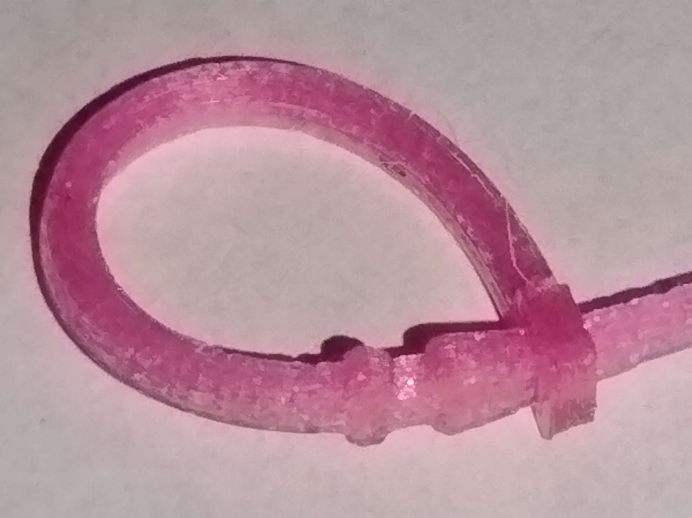

# Keyring - TPU

## Design Features
- Strong and resistant key ring that is printable
- TPU material is flexible and strong
- Easy printing
- Comfortable in pockets

## Usage
- Put the pointed tip through the loop
- Pull through until tight
- Slowly walk the loop over the tapered barb section
- TPU will stretch as it is forced
- Bend the barb section to stretch it out and flatten it and walk the loop
- Use finger nail to push each side of loop forward
- Once the loop is past the barb and into the groove, the TPU will go back to it's initial shape and it will be difficult to open accidentally
- Cut off the pointed tip with a filament cutter or scissors
- The ring could in theory be reused, but probably not worth the trouble since it is cheap and fast to make new ones.  
- The ring can be cut off to remove the keys and redo the key set on a new key ring.

## Dependencies
Depends on the BOSL2 library, of which a cached local version is included.
https://github.com/BelfrySCAD/BOSL2

## Print Notes
- TPU Filament
- Use your standard TPU print settings, or:
- Nozzle: 0.4mm Nozzle
- Layer Height: 0.2mm Height
- First Layer Width: 0.5mm
- Infill: 100%
- Perimeter: 3 Lines

## Images
### 
### Overview Image
New keyrings of various sizes, a closed keyring, a closed keyring with the tip cutoff and a keyring with keys.

### Usage Images
First Threading of tip through the loop.

Pulling the tip further through the loop

Nail pushing the loop over the curved stretched barb 

Walking the loop into over the barb

Loop locked into the barb slot, keyring complete

### OpenSCAD View

### PrusaSlicer View

## Thingiverse Link
